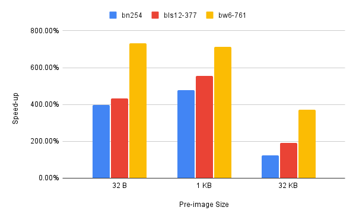
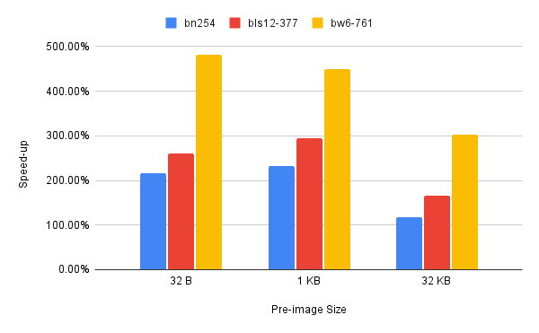
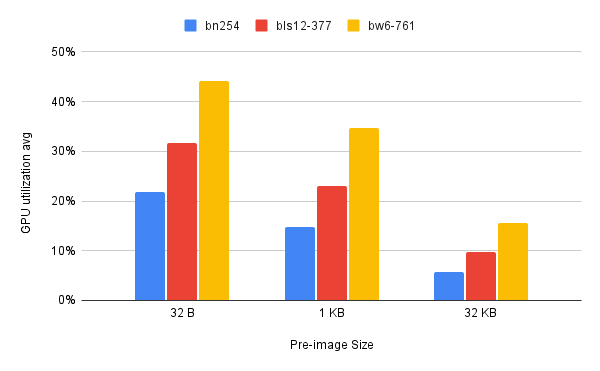
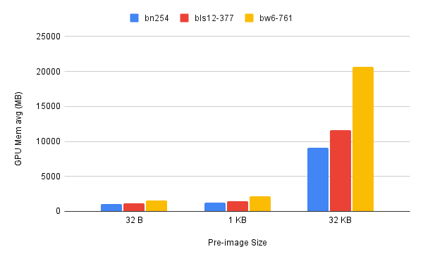
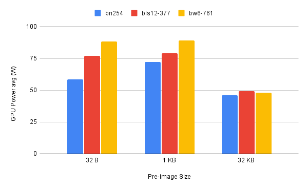

# Gnark_on_Icicle_benchmarking

Repo for Benchmarking the Gnark ZK Library using Icicle for GPU accelration

## Getting Started

### Requirements

- Ubuntu installation (tested on version 22.04.3 LTS)
- Docker
- Nvidia GPU
- Nvidia GPU drivers

### Setting up the docker container

To ease reproduceability, this repo is designed to run on a docker container. The docker container is defined in the provided `Docekrfile` and is based on an Ubuntu 20.04 with CUDA Toolkit 12.2 pre-installed.

After cloning the repo on your machine, build the container by running:

`docker build -t gnark-benchmark:dev .`

Then, start the container:

`nvidia-docker run -it -d --runtime nvidia --ipc=host -v $(pwd):/home --name gnark-benchmark gnark-benchmark:dev`

### Install the necessary dependencies

Open a terminal inside the container (by using the VS Code extension Dev containers for example) or by simply running the following command:

`nvidia-docker exec -it gnark_benchmark /bin/bash`

Before continuing we need to install `nano` and `wget` to be able to edit files from the terminal and download files

`apt update && apt install wget nano`

Download and install Go:

```bash
wget https://go.dev/dl/go1.21.6.linux-amd64.tar.gz
tar -C /usr/local -xzf go1.21.6.linux-amd64.tar.gz
rm go1.21.6.linux-amd64.tar.gz
```

Add the Go installation directory to PATH by adding the following line to `/etc/.profile`

`export PATH=$PATH:/usr/local/go/bin`

Update the PATH variable

`source /etc/.profile`

Check if Go was properly installed

`go version`

### Installing the go modules

Go back to the home directory (where the repo is cloned) and install the required Go modules

`go get -u`

### Building the Icicle shared libraries

Before running the code we need to create the icicle share libraries for each curve.

To do that go to `/root/go/pkg/mod/github.com/ingonyama-zk/icicle@v0.1.0/goicicle` and run:

`make all -j 4`

After the libraries are built, their PATH needs to be exported. Note that you need to run these two line every time you restart the container or open a new terminal

```bash
export CGO_LD_FLAGS=-L/root/go/pkg/mod/github.com/ingonyama-zk/icicle@v0.1.0/goicicle
export LD_LIBRARY_PATH=$LD_LIBRARY_PATH:/root/go/pkg/mod/github.com/ingonyama-zk/icicle@v0.1.0/goicicle/
```

### Circuits

For benchmarking we use 3 different circuits: cubic, exponentiate and sha256.
They are defined as follows:

- cubic:
  - Inputs: `y` : arbitrary size integer / public, `x` arbitrary size integer / secret,
  - Constraint: `y = x^3 + x + 5`
- exponentiate:
  - Inputs: `x`: arbitrary size unsigned integer / public, `y`: arbitrary size unsigned integer / public, `e`: 8-bit unsigned inetger / secret
  - Constraint: `y == x^e`
- sha256:
  - Inputs: `hash`: 32 byte hexadecimal string / public, 'preimage': arbitrary size hexadecimal string / secret
  - Constraint: `sha256(preimage) == hash

#### Note regarding input sizes

While a lot of the inputs are defined with arbitrary size, when generating random inputs the inputs are actually capped in size. The size of the randomly generated inputs are defined using constants in the package `constants`. The default values are saved under `constants/constants.go`. If you want to define your own values you can do that by changing the values in the file `constants/custom_constants.go`:

- `X_SIZE_CUBIC`: sets the size of the randomly generated x in the cubic circuit in bytes. Default value is 8
- `X_SIZE_EXP`: sets the size of the randomly generated x in the exponentiate circuit in bytes. Default value is 16
- `E_BITSIZE`: sets the size of the randomly generated e in the cubic circuit in bits. Default value is 8. It is advised to not change this value.
- `PREIMAGE_SIZE`: sets the size of the randomly generated pre-image in the sha256 circuit in bytes. Default value is 32. Note that you also need to change this constant when using a file as input when benchmarking the sha256 circuit to reflect the pre-images' size in the file.

### Running Benchmarks

To run the benchmark simply run the `main.go`. Here's an example command:
`go run -tags=icicle main.go -curve bn254 -GPU_Acc -circuit sha256 -n 10`

If you want to use custom values for the constants you need to add the `custom_const` tag:
`go run -tags=icicle,custom_const main.go -curve bn254 -GPU_Acc -circuit sha256 -n 10`
The programs takes inputs for benchmarking in two methods:

- The first method is by generating `n` random inputs and calculating the outputs. Note that `n` has a max value set by the constant `MAX_INPUTS` under `main.go`
- The second method is by having inputs defined in a file where each line represents a set of inputs separated by spaces. The order of inputs in the files for the 3 circuits is as follows:
  - cubic: x, y
  - exponentiate: x, y, e
  - sha256: hash, pre-image (make sure both are written in hexadecimal and not decimal)
Examples for files for each circuit are founder under `./inputs/`
The program takes the following arguments:

| Argument         | Description                            | Type         | Possible Values                      | Default Value |
|------------------|----------------------------------------|--------------|--------------------------------------|---------------|
| `-curve`         | Specify the curve for the ZK-Snark     | string       | bn254, bls12_377, bls12_381, bw6_761 | bn254         |
| `-GPU_Acc`       | Enable/disable GPU acceleration        | bool         | true, flase                          | false         |
| `-circuit`       | Choose the circuit to benchmark        | string       | cubic, exponentiate, sha256          | sha256        |
| `-file_path`     | Path to file with pre_computed inputs  | string       | empty string                         | empty string  |
| `-n`             | Number of inputs to generate randomly  | int          | all integer values                   | 10            |

Alternatively, we also created a bash script that runs multiple benchmarks with different parameter combinations (circuit, curve and GPU acceleration)
`./benchmark.sh`
Simply define the list of circuits, curves and whether GPU acceleration should be used or not and the script will run the benchmark for all possible combinations of parameters.

## Results

We ran the benchmark with the SHA256 circuit on a RTX A5000 (ADA version) GPU using multiple curves (bn254, bls12-377, bw6-761) and pre-image sizes (32 B, 1 KB, 32 KB) with and without GPU acceleration.

### Runtime of different steps of the ZK-Snark

a) CPU only

| Pre-image size | Curve      | Witness Gen. | Solution Gen. | Proof Gen. | Proof Verif. | Full run  |
|----------------|------------|--------------|---------------|-----------|--------------|------------|
| 32B            | bn254      | 0            | 203.51        | 564.25    | 1            | 770.46     |
|                | bls12-377  | 0            | 204.05        | 875.17    | 3            | 1083.73    |
|                | bw6-761    | 0            | 341.64        | 3886.05   | 12.02        | 4223.2     |
| 1KB            | bn254      | 2            | 722.69        | 1896.36   | 1            | 2624.07    |
|                | bls12-377  | 2            | 743.86        | 3192.36   | 3            | 3943.11    |
|                | bw6-761    | 2            | 1248.74       | 11133.76  | 12.01        | 12398.18   |
| 32KB           | bn254      | 71.48        | 16031.46      | 48383.4   | 1.06         | 64489.51   |
|                | bls12-377  | 72.1         | 16733.58      | 79313.35  | 3.03         | 96124.15   |
|                | bw6-761    | 72.58        | 28031.4       | 270904.65 | 12           | 299022.44  |

b) GPU-accelerated

| Pre-image size | Curve      | Witness Gen. | Solution Gen. | Proof Gen. | Proof Verif. | Full run  |
|----------------|------------|--------------|---------------|-----------|--------------|------------|
| 32B            | bn254      | 0            | 210.95        | 141.93    | 0.95         | 355.39     |
|                | bls12-377  | 0            | 210.29        | 202.71    | 3            | 417.39     |
|                | bw6-761    | 0            | 331.05        | 531       | 11.98        | 875.02     |
| 1KB            | bn254      | 2            | 730.39        | 398.15    | 0.96         | 1133.44    |
|                | bls12-377  | 2            | 751.42        | 576.09    | 3            | 1334.29    |
|                | bw6-761    | 2            | 1180.53       | 1559.72   | 11.9         | 2755.49    |
| 32KB           | bn254      | 72.59        | 16080.99      | 39009.16  | 1            | 55165.81   |
|                | bls12-377  | 72.61        | 16690.96      | 41402.2   | 3            | 58170.57   |
|                | bw6-761    | 72.97        | 26072.86      | 72952.94  | 11.99        | 99112.18   |

### Speed-up

<figure>
  <figcaption>Proof Generation speed-up</figcaption>
  
</figure>

<figure>
  <figcaption>Full run speed-up</figcaption>
  
</figure>

### GPU stats

<figure>
  <figcaption>GPU utilization</figcaption>
  
</figure>

<figure>
  <figcaption>GPU Memory</figcaption>
  
</figure>

<figure>
  <figcaption>GPU power</figcaption>
  
</figure>

### Notes

- The bls12-381 curve did not work with GPU acceleration. It simply ignores the prover options and runs with CPU only when using that curve.
- The proofs generated for the SHA256 circuit when using GPU acceleration are invalid (proof verification fails) irrespective of curve and pre-image size (This is not the case for Cubic and Exponentiate). The reason is unknown.
